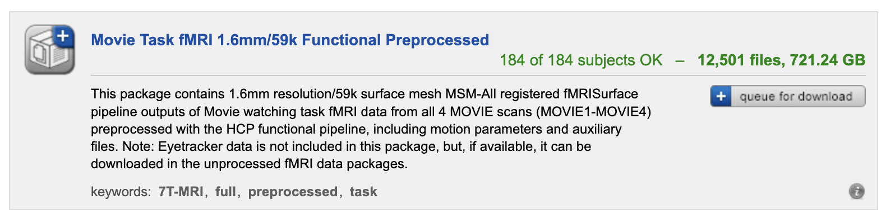
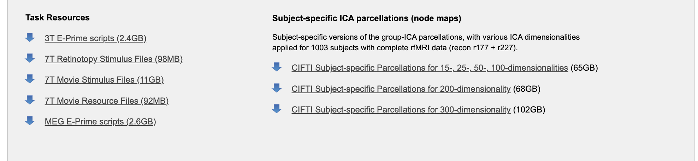

# SIM: Surface-based fMRI Analysis for Inter-Subject Multimodal Decoding from Movie-Watching Experiments - @ICLR 2025

This repo contains the codebase of the **SIM** framework: 

SIM is a, 
1. surface-based
2. self-supervised
3. tri-modal (audio,video, fMRI)

learning framework that generalised fMRI decoding during movie-watching experiments to new subjects and new movie scenes.


[ICLR Poster](https://iclr.cc/media/PosterPDFs/ICLR%202025/29830.png?t=1745303683.5205157) | [Arxiv Paper](https://arxiv.org/abs/2501.16471) | [Open Review Submision](https://openreview.net/forum?id=OJsMGsO6yn)

<details>
    <summary><b> V 0.2 - 23.04.25</b></summary>
    Initial commits
    <ul type="circle">
        <li> Adding audio/video preprocessing scripts</li>
    </ul>
</details>
<details>
    <summary><b> V 0.1 - 07.03.25</b></summary>
    Initial commits
    <ul type="circle">
        <li> Adding basis of the SIM codebase for tri-modal alignment</li>
    </ul>
</details>

<br>

# Installation & Set-up

## 1. Conda installation

For cuda usage and python dependencies installation please follow instructions in [install.md](./config/docs/install.md).

## 2. Docker installation

**Coming Soon**

# Data Access

## 1. 7T HCP movie-watching fMRI data

This work uses the [HCP 7T movie-watching](https://www.humanconnectome.org/hcp-protocols-ya-7t-imaging) experiment from [1]. fMRI raw files can be directly downloaded from the HCP platform [https://db.humanconnectome.org/](https://db.humanconnectome.org/app/template/Login.vm;jsessionid=8A8D34FBD9A938DAC157617B7D66672C), following registration. 

We used the Movie Task fMRI 1.6mm/59k Functional Preprocessed data files (~700GB) available for download on [https://db.humanconnectome.org/](https://db.humanconnectome.org/app/template/Login.vm;jsessionid=8A8D34FBD9A938DAC157617B7D66672C) (see image). 



[1] David C. Van Essen, Stephen M. Smith, Deanna M. Barch, Timothy E.J. Behrens, Essa Yacoub, and Kamil Ugurbil. The WU-Minn Human Connectome Project: An overview. NeuroImage, 80:62–79, 10 2013. ISSN 10538119.

## 2. 7T HCP movie-watching movies

Movie files are avaialble for download on the HCP platform [https://db.humanconnectome.org/]() under **7T Movie Stimulus Files (11GB)** (see image). There are 4 movies files in mp4 format: 7T_MOVIE1_CC1.mp4, 7T_MOVIE2_HO1.mp4, 7T_MOVIE3_CC2.mp4, 7T_MOVIE4_HO4.mp4. 



There are 4 fMRI recording sessions that we will call for simplicity `MOVIE1-4`,respectively corresponding to 7T_MOVIE1_CC1.mp4, 7T_MOVIE2_HO1.mp4, 7T_MOVIE3_CC2.mp4 and 7T_MOVIE4_HO4.mp4. 


# Preprocessing

## 1. fMRI data

Once downloading the HCP data, the fMRI raw files are located in `./{subjectID}/MNINonLinear/Results/{fMRI_session_ID}/tfMRI_MOVIE1_7T_AP_Atlas_1.6mm_MSMAll_hp2000_clean.dtseries.nii` 

The following steps are performed:
1. Cifti files are separated into left and right hemispheres.
2. The resulting gifti files are then demeaned.
3. Then resampled from native resolution (59292 vertices) to $I6$ resolution (40962 vertices). This resampling is necessary to integrate with the SiT framework, which utilises regular icosahedral grids (e.g. $I3$) to patch the input surface data (at $I6$).
4. Right hemispheres are symmetrised to appear like left hemispheres. 
5. fMRI frames are extracted at **TR=1** second and saved into gifti files.

**Coming Soon**: fMRI processing script

## 2. Movie files extraction

All fMRI sessions (MOVIE1-4) were divided into overlapping 3-seconds `.mp4v` movie-clips using the OpenCV library (shifted by 1sec). Preprocessing script is available in [./processing/step_1_movie_clip_extraction.ipynb](./processing/step_1_movie_clip_extraction.ipynb).

Audio files are then extracted to `.wav` format at 16kHz from all movie clips using the
torchaudio library. Preprocessing script is available in https://github.com/open-mmlab/mmaction2

## 3. Video/Audio embedding extraction files extraction

1. Video frames

We used the pre-trained VideoMAE model available on the [MMAction2](https://github.com/open-mmlab/mmaction2) to extract video-frames embedding representation from the 3s movie-clips.

A preprocessing script is available in [./processing/step_2_extract_embeddings_videomae.py](./processing/step_2_extract_embeddings_videomae.py).


2. Audio

We used a pre-trained Wav2Vec2.0 from the torchaudio library `torchaudio.pipelines.WAV2VEC2_ASR_BASE_960H` to extract audio features from 3s video clips.

A preprocessing script is available in [./processing/step_2_extract_embeddings_wave2vec.py](./processing/step_2_extract_embeddings_wave2vec.py).


# Training

The training commands are run using `torchrun` and using config files located under `/config/`.

## fMRI & Video & Audio

For training the SIM pipeline with all three modalities, please run:

```
cd tools/
torchrun --nproc_per_node=1 --nnodes=1  train_fmri_clip_ddp.py ../config/CLIP-fmri-video-audio/hparams.yml 
```

## fMRI & Video

For training the SIM pipeline with fMRI and video modalities, please run:

```
cd tools/
torchrun --nproc_per_node=1 --nnodes=1  train_fmri_clip_ddp.py ../config/CLIP-video/hparams.yml 
```

## fMRI & Video & Audio

For training the SIM pipeline with fMRI and audio modalities, please run:

```
cd tools/
torchrun --nproc_per_node=1 --nnodes=1  train_fmri_clip_ddp.py ../config/CLIP-audio/hparams.yml 
```

# Retrival Testing

Retrieval testing 


[**TODO**] add the retrieval scripts


# Video-frame Reconstruction
